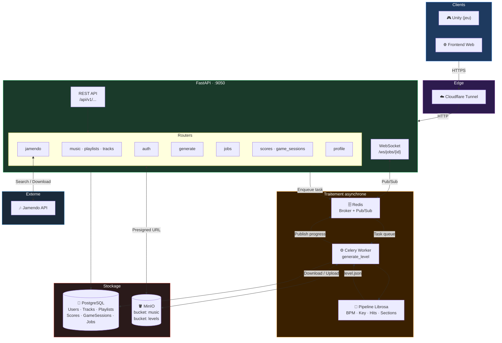
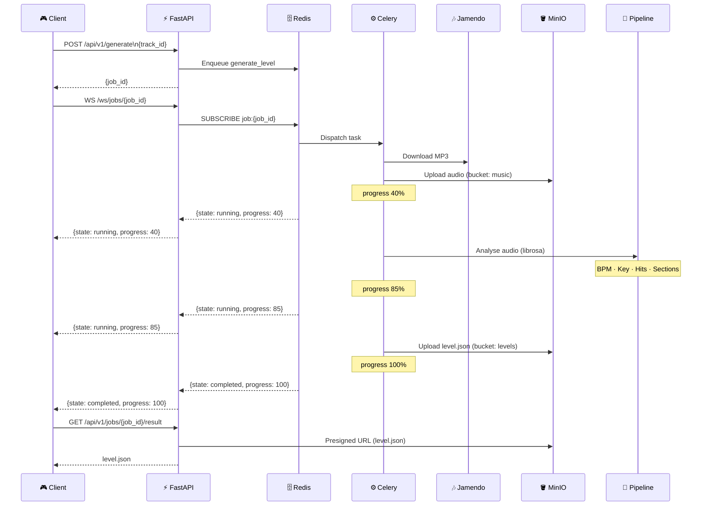

# PulseDash — Architecture Backend

## Vue d'ensemble

---

## Flux : génération d'un niveau

---

## Stack technique

| Couche | Technologie |
|--------|-------------|
| **API** | FastAPI · Uvicorn · SQLAlchemy · Alembic |
| **Auth** | JWT (Bearer token) · SlowAPI (rate limiting) |
| **Async** | Celery · Redis (broker + pub/sub) |
| **Pipeline** | librosa · numpy |
| **BDD** | PostgreSQL 16 |
| **Stockage fichiers** | MinIO (S3-compatible) |
| **Musique externe** | Jamendo API |
| **Infra** | Podman Compose · Cloudflare Tunnel |
