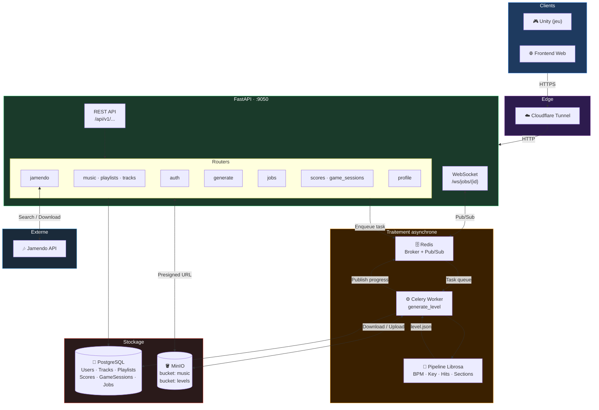
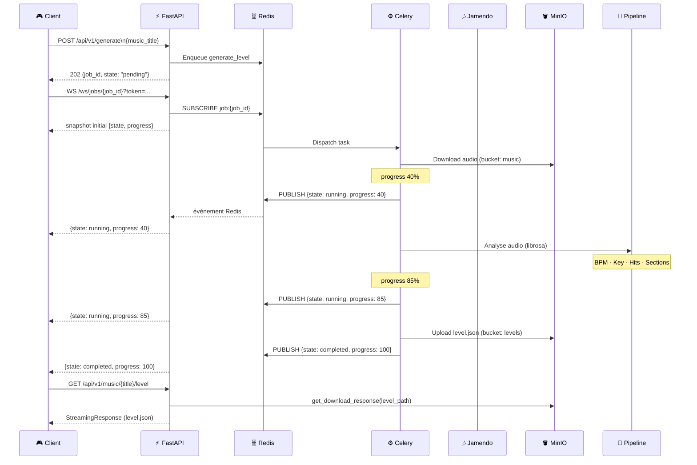
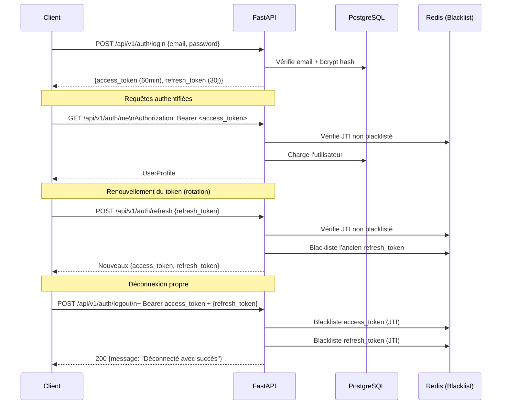
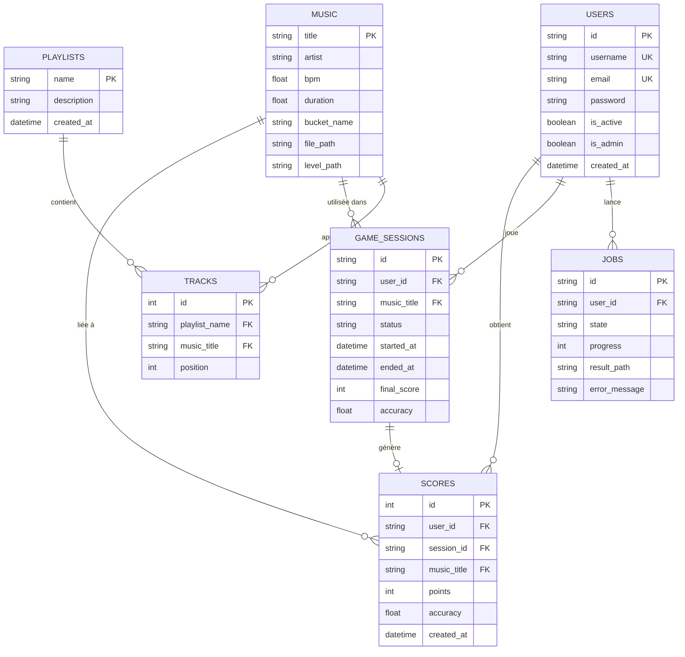

# PulseDash — Architecture Backend

## Vue d'ensemble

PulseDash API suit une architecture **en couches** déployée sur un serveur Linux. Elle combine un serveur HTTP asynchrone (FastAPI/Uvicorn), un broker de tâches asynchrones (Celery/Redis), un stockage objet S3-compatible (MinIO) et une base de données relationnelle (PostgreSQL). L'exposition publique est assurée via un tunnel Cloudflare.



---

## Flux : génération d'un niveau

La génération de niveau est le cœur du système. L'API répond immédiatement en `202 Accepted` et délègue le traitement audio (analyse BPM, détection des beats, génération JSON) à un worker Celery. Le client suit la progression via WebSocket.



---

## Flux d'authentification et gestion des tokens



---

## Modèle de données (ERD)



---

## Stack technique

| Couche | Technologie |
|--------|-------------|
| **API** | FastAPI · Uvicorn · SQLAlchemy · Alembic |
| **Auth** | JWT HS256 (python-jose) · bcrypt · SlowAPI |
| **Async** | Celery · Redis (broker + pub/sub + blacklist) |
| **Pipeline audio** | librosa · numpy |
| **Base de données** | PostgreSQL 16 |
| **Stockage fichiers** | MinIO (S3-compatible) |
| **Musique externe** | Jamendo API |
| **Infra** | Podman Compose · Cloudflare Tunnel |

---

## Organisation du code source

```
src/api/
├── core/
│   ├── config.py          # Settings Pydantic (env vars)
│   ├── celery_app.py      # Instance Celery
│   └── limiter.py         # SlowAPI rate limiter
├── db/
│   ├── models/            # Modèles SQLAlchemy
│   ├── repositories/      # Pattern Repository (accès données)
│   ├── migrations/        # Migrations Alembic
│   └── session.py         # Engine + Session SQLAlchemy
├── routers/               # Endpoints FastAPI (10 modules)
├── schemas/               # Modèles Pydantic I/O
├── services/
│   ├── auth.py            # Logique JWT, bcrypt
│   ├── storage.py         # Interface MinIO
│   ├── tasks.py           # Tâches Celery
│   ├── jamendo.py         # Client API Jamendo
│   └── token_blacklist.py # Blacklist Redis JTI
├── dependencies.py        # Injections (get_current_user, get_admin_user)
└── main.py                # Factory app + WebSocket /ws/jobs/{id}
```

### Décisions architecturales notables

**Repository Pattern** — La couche `repositories/` découple la logique métier de SQLAlchemy.

**202 Accepted + WebSocket** — La génération de niveaux étant longue, l'API répond immédiatement et pousse les mises à jour de progression via WebSocket/Redis Pub/Sub.

**Rotation du Refresh Token** — À chaque appel `/auth/refresh`, l'ancien token est blacklisté et un nouveau est émis. Cela prévient la réutilisation d'un token volé (détection de vol par re-use).

**JTI Blacklist** — Les tokens JWT sont révoqués par leur champ `jti` (UUID unique par token) stocké dans Redis avec un TTL calqué sur l'expiration du token.
