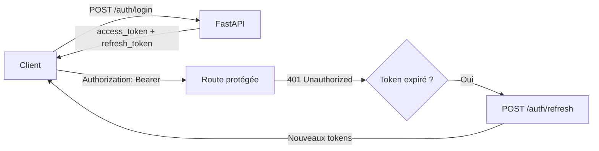

# Authentification

PulseDash utilise une authentification **JWT (JSON Web Token)** avec un système à deux tokens : un **access token** de courte durée et un **refresh token** de longue durée avec rotation automatique.

---

## Mécanisme général



---

## Tokens JWT

| Paramètre | Access Token | Refresh Token |
|---|---|---|
| **Algorithme** | HS256 | HS256 |
| **Expiration** | 60 minutes | 30 jours |
| **Champ `type`** | `"access"` | `"refresh"` |
| **Usage** | Routes protégées | Renouvellement uniquement |

### Structure du payload

```json
{
  "sub": "550e8400-e29b-41d4-a716-446655440000",
  "exp": 1716000000,
  "type": "access",
  "jti": "a1b2c3d4-e5f6-7890-abcd-ef1234567890"
}
```

| Champ | Description |
|---|---|
| `sub` | UUID de l'utilisateur |
| `exp` | Timestamp Unix d'expiration |
| `type` | `"access"` ou `"refresh"` |
| `jti` | UUID unique du token (pour la blacklist) |

---

## Envoi du token dans les requêtes

Toutes les routes protégées nécessitent l'en-tête :

```http
Authorization: Bearer <access_token>
```

!!! warning "Sécurité"
    Ne jamais inclure le token dans l'URL (query parameter). Utiliser exclusivement l'en-tête `Authorization`.

---

## Révocation et blacklist

Lors d'un **logout** ou d'un **refresh**, les tokens concernés sont révoqués via leur `jti` stocké dans Redis (base `REDIS_BLACKLIST_DB = 1`). Le TTL Redis est calqué sur le temps restant avant expiration du token.

À chaque requête authentifiée, le middleware vérifie que le `jti` du token n'est pas dans la blacklist avant d'autoriser l'accès.

---

## Niveaux d'accès

| Niveau | Middleware | Description |
|---|---|---|
| **Public** | Aucun | Accessible sans token |
| **Authentifié** | `get_current_user` | Requiert un access token valide, utilisateur actif |
| **Admin** | `get_admin_user` | Requiert de plus `user.is_admin == True` |

### Routes publiques notables

- `GET /` (healthcheck)
- `POST /api/v1/auth/register`
- `POST /api/v1/auth/login`
- `POST /api/v1/auth/refresh`
- `GET /api/v1/music`
- `GET /api/v1/music/{title}`
- `GET /api/v1/playlists`
- `GET /api/v1/scores/top`
- `GET /api/v1/scores/global`
- `GET /api/v1/profile/{user_id}`

### Routes admin uniquement

- `PUT /api/v1/music/{title}`
- `DELETE /api/v1/music/{title}`

---

## Gestion des erreurs d'authentification

| Code | Situation |
|---|---|
| `401 Unauthorized` | Token absent, invalide, expiré ou blacklisté |
| `403 Forbidden` | Token valide mais compte désactivé (`is_active=False`) ou droits insuffisants |
| `429 Too Many Requests` | Dépassement de la limite de débit sur les routes d'auth |

---

## Hachage des mots de passe

Les mots de passe sont hachés avec **bcrypt** (coût adaptatif). Le mot de passe en clair n'est jamais stocké ni transmis dans les réponses.

Contrainte minimale : **8 caractères**.
