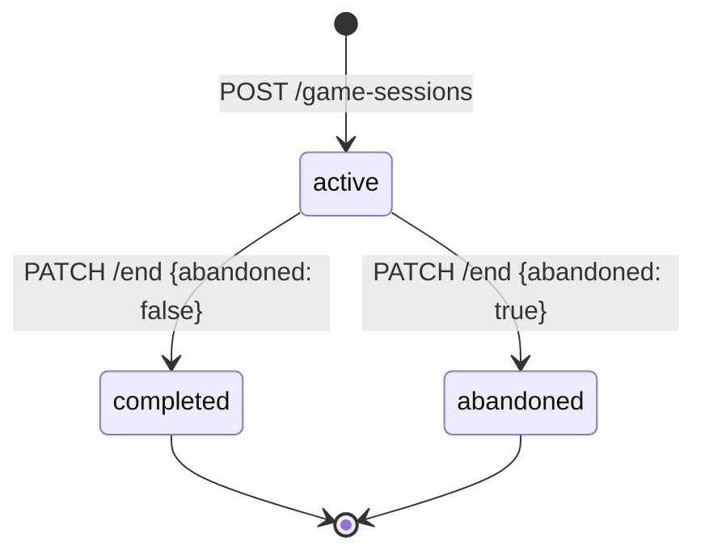

# Sessions de jeu

Gestion du cycle de vie d'une partie : démarrage, clôture avec enregistrement du score, et historique.

**Préfixe :** `/api/v1/game-sessions`

---

## Cycle de vie d'une session



| Statut | Description |
|---|---|
| `active` | Session en cours |
| `completed` | Session terminée normalement, score enregistré |
| `abandoned` | Session abandonnée, aucun score enregistré |

---

## POST /game-sessions

Démarre une nouvelle session de jeu pour une musique donnée.

**`POST /api/v1/game-sessions`** 🔒 *Authentification requise*

### Body (application/json)

| Champ | Type | Requis | Description |
|---|---|---|---|
| `music_title` | string | Oui | Titre de la musique (doit exister en BDD) |

=== "Requête"
    ```bash
    curl -X POST https://pulsedashapi.floabd.app/api/v1/game-sessions \
      -H "Authorization: Bearer <token>" \
      -H "Content-Type: application/json" \
      -d '{"music_title": "Midnight Drive"}'
    ```

=== "201 Created"
    ```json
    {
      "id": "b2c3d4e5-f6a7-8901-bcde-f01234567890",
      "user_id": "550e8400-e29b-41d4-a716-446655440000",
      "music_title": "Midnight Drive",
      "status": "active",
      "started_at": "2024-05-22T15:25:00Z",
      "ended_at": null,
      "final_score": null,
      "accuracy": null
    }
    ```

=== "401 Unauthorized"
    ```json
    { "detail": "Token invalide" }
    ```

=== "404 Not Found — Musique inexistante"
    ```json
    { "detail": "Music not found" }
    ```

---

## PATCH /game-sessions/{session_id}/end

Clôture une session active. Si `abandoned` est `false`, un enregistrement de score est automatiquement créé en base.

**`PATCH /api/v1/game-sessions/{session_id}/end`** 🔒 *Authentification requise*

### Path Parameters

| Paramètre | Type | Description |
|---|---|---|
| `session_id` | string (UUID) | Identifiant de la session |

### Body (application/json)

| Champ | Type | Requis | Contraintes | Description |
|---|---|---|---|---|
| `final_score` | integer | Oui | ≥ 0 | Score final de la partie |
| `accuracy` | float | Non | 0.0–1.0 | Précision (ratio de notes bien jouées) |
| `abandoned` | boolean | Non | défaut `false` | Si `true` : aucun score n'est enregistré |

=== "Requête — Partie terminée"
    ```bash
    curl -X PATCH \
      "https://pulsedashapi.floabd.app/api/v1/game-sessions/b2c3d4e5-f6a7-8901-bcde-f01234567890/end" \
      -H "Authorization: Bearer <token>" \
      -H "Content-Type: application/json" \
      -d '{
        "final_score": 98500,
        "accuracy": 0.9842,
        "abandoned": false
      }'
    ```

=== "Requête — Partie abandonnée"
    ```bash
    curl -X PATCH \
      "https://pulsedashapi.floabd.app/api/v1/game-sessions/b2c3d4e5-f6a7-8901-bcde-f01234567890/end" \
      -H "Authorization: Bearer <token>" \
      -H "Content-Type: application/json" \
      -d '{"final_score": 0, "abandoned": true}'
    ```

=== "200 OK"
    ```json
    {
      "id": "b2c3d4e5-f6a7-8901-bcde-f01234567890",
      "user_id": "550e8400-e29b-41d4-a716-446655440000",
      "music_title": "Midnight Drive",
      "status": "completed",
      "started_at": "2024-05-22T15:25:00Z",
      "ended_at": "2024-05-22T15:28:45Z",
      "final_score": 98500,
      "accuracy": 0.9842
    }
    ```

=== "401 Unauthorized"
    ```json
    { "detail": "Token invalide" }
    ```

=== "403 Forbidden — Session d'un autre utilisateur"
    ```json
    { "detail": "Not your session" }
    ```

=== "404 Not Found"
    ```json
    { "detail": "Session not found" }
    ```

=== "409 Conflict — Session déjà terminée"
    ```json
    { "detail": "Session already ended" }
    ```

---

## GET /game-sessions/me

Retourne l'historique des sessions de l'utilisateur authentifié (les plus récentes en premier).

**`GET /api/v1/game-sessions/me`** 🔒 *Authentification requise*

### Query Parameters

| Paramètre | Type | Défaut | Description |
|---|---|---|---|
| `limit` | integer | `50` | Nombre maximum de sessions |

=== "Requête"
    ```bash
    curl "https://pulsedashapi.floabd.app/api/v1/game-sessions/me?limit=5" \
      -H "Authorization: Bearer <token>"
    ```

=== "200 OK"
    ```json
    [
      {
        "id": "b2c3d4e5-f6a7-8901-bcde-f01234567890",
        "user_id": "550e8400-e29b-41d4-a716-446655440000",
        "music_title": "Midnight Drive",
        "status": "completed",
        "started_at": "2024-05-22T15:25:00Z",
        "ended_at": "2024-05-22T15:28:45Z",
        "final_score": 98500,
        "accuracy": 0.9842
      },
      {
        "id": "c3d4e5f6-a7b8-9012-cdef-012345678901",
        "user_id": "550e8400-e29b-41d4-a716-446655440000",
        "music_title": "Neon Lights",
        "status": "abandoned",
        "started_at": "2024-05-21T18:40:00Z",
        "ended_at": "2024-05-21T18:41:20Z",
        "final_score": 0,
        "accuracy": null
      }
    ]
    ```

=== "401 Unauthorized"
    ```json
    { "detail": "Token invalide" }
    ```
