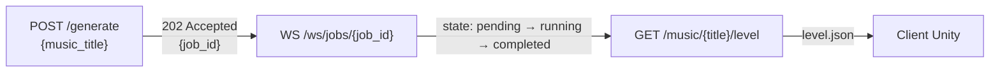

# Génération de niveau

Lance le pipeline de génération automatique d'un niveau de jeu à partir d'un fichier audio existant dans le catalogue.

**Préfixe :** `/api/v1`

---

## Principe de fonctionnement

La génération est un traitement **asynchrone** en deux temps :

1. **`POST /generate`** — Soumet la requête, crée un job en base, enfile la tâche dans Celery. Répond immédiatement en `202 Accepted` avec un `job_id`.
2. **`WS /ws/jobs/{job_id}`** ou **`GET /jobs/{job_id}`** — Suit la progression du job.



---

## POST /generate

Lance la génération d'un niveau pour une musique dont le fichier audio est déjà stocké dans MinIO.

!!! info "Rate limit"
    10 requêtes / minute par IP.

**`POST /api/v1/generate`** 🔒 *Authentification requise*

### Body (application/json)

| Champ | Type | Requis | Description |
|---|---|---|---|
| `music_title` | string | Oui | Titre exact de la musique (doit exister en base avec un `file_path`) |

### Prérequis

- La musique identifiée par `music_title` doit exister dans la table `music`.
- Le champ `file_path` de cette musique doit être non-nul (le fichier audio doit être présent dans MinIO).

=== "Requête"
    ```bash
    curl -X POST https://pulsedashapi.floabd.app/api/v1/generate \
      -H "Authorization: Bearer <token>" \
      -H "Content-Type: application/json" \
      -d '{"music_title": "Midnight Drive"}'
    ```

=== "202 Accepted"
    ```json
    {
      "job_id": "a1b2c3d4-e5f6-7890-abcd-ef1234567890",
      "state": "pending"
    }
    ```

=== "400 Bad Request — Pas de fichier audio"
    ```json
    { "detail": "Music has no audio file in storage" }
    ```

=== "401 Unauthorized"
    ```json
    { "detail": "Token invalide" }
    ```

=== "404 Not Found — Musique inexistante"
    ```json
    { "detail": "Music not found" }
    ```

=== "429 Too Many Requests"
    ```json
    { "error": "Rate limit exceeded: 10 per 1 minute" }
    ```

---

## Cycle de vie d'un job

| État | Description |
|---|---|
| `pending` | En attente de traitement par un worker Celery |
| `running` | Pipeline en cours d'exécution |
| `completed` | Niveau généré et stocké dans MinIO |
| `failed` | Une erreur est survenue pendant le traitement |

La progression est un entier entre `0` et `100` publié en temps réel via Redis Pub/Sub.

---

## Workflow complet (exemple Unity)

```bash
# 1. Lancer la génération
RESPONSE=$(curl -s -X POST https://pulsedashapi.floabd.app/api/v1/generate \
  -H "Authorization: Bearer $TOKEN" \
  -H "Content-Type: application/json" \
  -d '{"music_title": "Midnight Drive"}')

JOB_ID=$(echo $RESPONSE | jq -r '.job_id')
echo "Job lancé : $JOB_ID"

# 2. Interroger le statut (polling HTTP — alternative au WebSocket)
curl "https://pulsedashapi.floabd.app/api/v1/jobs/$JOB_ID" \
  -H "Authorization: Bearer $TOKEN"

# 3. Une fois state=completed, télécharger le niveau
curl "https://pulsedashapi.floabd.app/api/v1/music/Midnight%20Drive/level" \
  --output level.json
```

!!! tip "Préférer le WebSocket"
    Pour une expérience temps réel optimale (barre de chargement dans Unity), utiliser le WebSocket `/ws/jobs/{job_id}` plutôt que du polling HTTP. Voir la section [WebSocket](../websocket.md).
