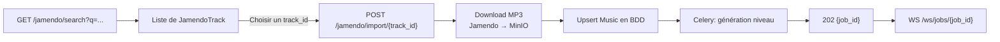

# Jamendo

Intégration avec l'[API Jamendo](https://developer.jamendo.com/v3.0) pour la recherche et l'import de musiques libres de droits directement dans le catalogue PulseDash.

**Préfixe :** `/api/v1/jamendo`

---

## Vue d'ensemble du flux Jamendo



---

## GET /jamendo/search

Recherche des morceaux sur Jamendo par titre ou artiste.

!!! info "Rate limit"
    30 requêtes / minute par IP.

**`GET /api/v1/jamendo/search`**

### Query Parameters

| Paramètre | Type | Requis | Contraintes | Description |
|---|---|---|---|---|
| `q` | string | Oui | 1–100 caractères | Terme de recherche |
| `limit` | integer | Non | 1–50, défaut `10` | Nombre de résultats |

=== "Requête"
    ```bash
    curl "https://pulsedashapi.floabd.app/api/v1/jamendo/search?q=synthwave&limit=5"
    ```

=== "200 OK"
    ```json
    [
      {
        "id": "1234567",
        "name": "Neon Drift",
        "artist_name": "Synthetix",
        "duration": 198,
        "image": "https://usercontent.jamendo.com/?type=album&id=123",
        "audio": "https://mp3d.jamendo.com/download/track/1234567/mp32"
      },
      {
        "id": "7654321",
        "name": "Retro Wave",
        "artist_name": "ChromaBeats",
        "duration": 245,
        "image": null,
        "audio": "https://mp3d.jamendo.com/download/track/7654321/mp32"
      }
    ]
    ```

=== "502 Bad Gateway — Jamendo indisponible"
    ```json
    { "detail": "Jamendo unavailable: Connection timeout" }
    ```

=== "429 Too Many Requests"
    ```json
    { "error": "Rate limit exceeded: 30 per 1 minute" }
    ```

---

## POST /jamendo/import/{track_id}

Importe un morceau Jamendo en :

1. Récupérant ses métadonnées (titre, artiste, durée)
2. Téléchargeant le fichier MP3 vers MinIO (bucket `music`)
3. Créant ou mettant à jour l'entrée `Music` en base de données
4. Lançant automatiquement le pipeline de génération de niveau (Celery)

Retourne un `job_id` à suivre via WebSocket ou polling HTTP.

!!! info "Rate limit"
    10 requêtes / minute par IP.

**`POST /api/v1/jamendo/import/{track_id}`** 🔒 *Authentification requise*

### Path Parameters

| Paramètre | Type | Description |
|---|---|---|
| `track_id` | string | Identifiant Jamendo du morceau (ex: `"1234567"`) |

=== "Requête"
    ```bash
    curl -X POST https://pulsedashapi.floabd.app/api/v1/jamendo/import/1234567 \
      -H "Authorization: Bearer <token>"
    ```

=== "202 Accepted"
    ```json
    {
      "job_id": "a1b2c3d4-e5f6-7890-abcd-ef1234567890",
      "music_title": "Neon Drift",
      "state": "pending"
    }
    ```

=== "401 Unauthorized"
    ```json
    { "detail": "Token invalide" }
    ```

=== "404 Not Found — Track Jamendo introuvable"
    ```json
    { "detail": "Track 9999999 not found on Jamendo" }
    ```

=== "502 Bad Gateway — Jamendo indisponible"
    ```json
    { "detail": "Jamendo unavailable: <message>" }
    ```

=== "502 Bad Gateway — Téléchargement échoué"
    ```json
    { "detail": "Audio download failed: <message>" }
    ```

=== "502 Bad Gateway — URL audio manquante"
    ```json
    { "detail": "No audio URL returned by Jamendo" }
    ```

=== "500 Internal Server Error — Upload MinIO"
    ```json
    { "detail": "Storage upload failed: <message>" }
    ```

=== "429 Too Many Requests"
    ```json
    { "error": "Rate limit exceeded: 10 per 1 minute" }
    ```

---

## Comportement idempotent de l'import

Si une musique avec le même titre existe déjà en base, son `file_path` est mis à jour avec le nouveau fichier téléchargé (opération **upsert**). Un nouveau job de génération est lancé dans tous les cas.
