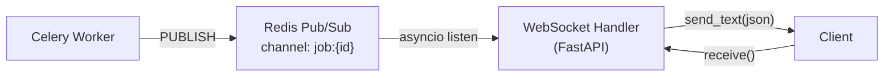

# WebSocket — Suivi temps réel des jobs

Le serveur expose un endpoint WebSocket permettant de suivre en temps réel la progression d'un job de génération de niveau.

---

## Connexion

**`WS /ws/jobs/{job_id}?token=<access_token>`**

!!! warning "Authentification par query parameter"
    Contrairement aux routes REST qui utilisent l'en-tête `Authorization: Bearer`, le WebSocket exige le token JWT via le **query parameter `token`**. Cela est dû aux limitations des clients WebSocket qui ne supportent pas toujours les en-têtes HTTP personnalisés lors du handshake.

### Path Parameters

| Paramètre | Type | Description |
|---|---|---|
| `job_id` | string (UUID) | Identifiant du job à suivre |

### Query Parameters

| Paramètre | Type | Requis | Description |
|---|---|---|---|
| `token` | string | Oui | Access token JWT valide |

---

## Sécurité de la connexion

Lors de l'ouverture de la connexion, le serveur effectue les vérifications suivantes :

1. **Décodage et validation du JWT** — Si le token est invalide ou expiré, la connexion est fermée avec le code `1008` (Policy Violation).
2. **Existence et activité de l'utilisateur** — L'utilisateur doit exister en base et avoir `is_active = true`.
3. **Propriété du job** — L'utilisateur doit être le propriétaire du job. Sinon, connexion fermée avec `1008`.

---

## Messages reçus

Tous les messages sont en format **JSON** (text frame).

### Snapshot initial

Envoyé immédiatement après la connexion, il reflète l'état actuel du job en base de données.

```json
{
  "job_id": "a1b2c3d4-e5f6-7890-abcd-ef1234567890",
  "state": "pending",
  "progress": 0
}
```

Si le job est déjà `completed` ou `failed` lors de la connexion, ce snapshot est le seul message envoyé, et la connexion se ferme immédiatement.

### Mises à jour de progression

Publiées par le worker Celery via Redis Pub/Sub et relayées au client.

```json
{
  "job_id": "a1b2c3d4-e5f6-7890-abcd-ef1234567890",
  "state": "running",
  "progress": 65
}
```

### Message de complétion

```json
{
  "job_id": "a1b2c3d4-e5f6-7890-abcd-ef1234567890",
  "state": "completed",
  "progress": 100
}
```

### Message d'échec

```json
{
  "job_id": "a1b2c3d4-e5f6-7890-abcd-ef1234567890",
  "state": "failed",
  "progress": 40,
  "error": "Librosa failed: unsupported audio format"
}
```

### Message d'erreur (job introuvable)

```json
{
  "error": "job not found"
}
```

---

## Champs des messages

| Champ | Type | Description |
|---|---|---|
| `job_id` | string | UUID du job |
| `state` | string | `pending`, `running`, `completed`, `failed` |
| `progress` | integer | Progression de 0 à 100 |
| `error` | string | Message d'erreur (présent uniquement si `state == "failed"`) |

---

## Comportement de fermeture

La connexion WebSocket se ferme dans les cas suivants :

| Cause | Code de fermeture |
|---|---|
| Token invalide / utilisateur non autorisé | `1008` (Policy Violation) |
| Job inexistant | Fermeture propre après envoi de `{"error": "job not found"}` |
| Job déjà terminé (`completed` / `failed`) | Fermeture propre après le snapshot |
| Job complété ou échoué pendant la session | Fermeture propre après l'événement final |
| Déconnexion du client | Nettoyage côté serveur (unsubscribe Redis, libération ressources) |

---

## Exemple d'implémentation

=== "JavaScript (navigateur)"
    ```javascript
    const jobId = "a1b2c3d4-e5f6-7890-abcd-ef1234567890";
    const token = localStorage.getItem("access_token");
    const ws = new WebSocket(
      `wss://pulsedashapi.floabd.app/ws/jobs/${jobId}?token=${token}`
    );

    ws.onmessage = (event) => {
      const data = JSON.parse(event.data);
      console.log(`[${data.state}] ${data.progress}%`);

      if (data.state === "completed") {
        console.log("Niveau prêt ! Téléchargement...");
        ws.close();
        downloadLevel(data.job_id);
      } else if (data.state === "failed") {
        console.error("Génération échouée :", data.error);
        ws.close();
      }
    };

    ws.onerror = (error) => console.error("WebSocket error:", error);
    ws.onclose = () => console.log("Connexion fermée");
    ```

=== "Python (websockets)"
    ```python
    import asyncio, json, websockets

    async def track_job(job_id: str, token: str):
        url = f"wss://pulsedashapi.floabd.app/ws/jobs/{job_id}?token={token}"
        async with websockets.connect(url) as ws:
            async for message in ws:
                data = json.loads(message)
                print(f"[{data['state']}] progress={data.get('progress', 0)}%")
                if data["state"] in ("completed", "failed"):
                    break

    asyncio.run(track_job("a1b2c3d4-...", "eyJhbGci..."))
    ```

=== "C# (Unity — NativeWebSocket)"
    ```csharp
    using NativeWebSocket;
    using System;
    using UnityEngine;

    public class JobTracker : MonoBehaviour
    {
        private WebSocket _ws;

        public async void TrackJob(string jobId, string token)
        {
            string url = $"wss://pulsedashapi.floabd.app/ws/jobs/{jobId}?token={token}";
            _ws = new WebSocket(url);

            _ws.OnMessage += (bytes) =>
            {
                string json = System.Text.Encoding.UTF8.GetString(bytes);
                var data = JsonUtility.FromJson<JobEvent>(json);
                Debug.Log($"[{data.state}] {data.progress}%");

                if (data.state == "completed")
                    Debug.Log("Niveau généré !");
                else if (data.state == "failed")
                    Debug.LogError($"Erreur : {data.error}");
            };

            await _ws.Connect();
        }

        private void Update() => _ws?.DispatchMessageQueue();
        private async void OnDestroy() => await _ws?.Close();

        [Serializable]
        private class JobEvent
        {
            public string job_id, state, error;
            public int progress;
        }
    }
    ```

---

## Architecture interne du relay



Le handler WebSocket utilise `asyncio.wait` avec `FIRST_COMPLETED` pour terminer proprement quand l'une des deux sources se termine en premier : le flux Redis (job terminé) ou le client (déconnexion).
